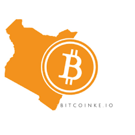

# Web3 | Blockchain Bootcamp: 06/03 to 06/05

>A bootcamp by bitcoinke.io on Web3 and Blockhain tools and technologies.

### Tools and Technologies:

- git
- nodejs
- nearcli
- rust

### Quick Notes:

- near wallet and near explorer
- smart contract
- web assemblies - standardised and performs well, can be used with a variety of languages
- assemblyscript - for safer code, iteraction on top of typescript
- rust is easy created to avoid the cons of C++

